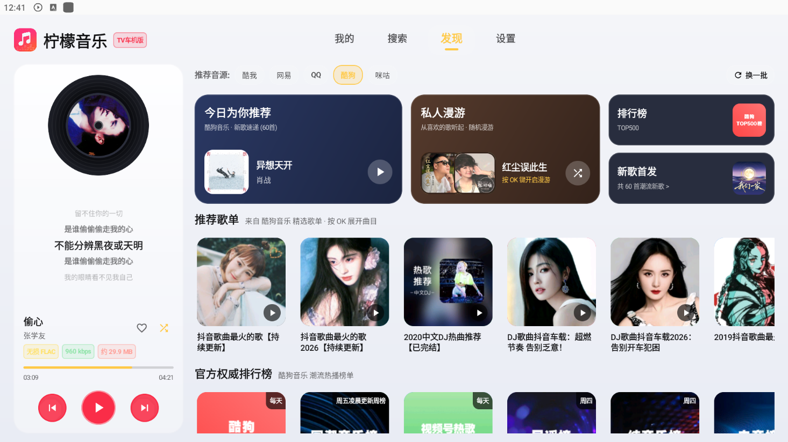
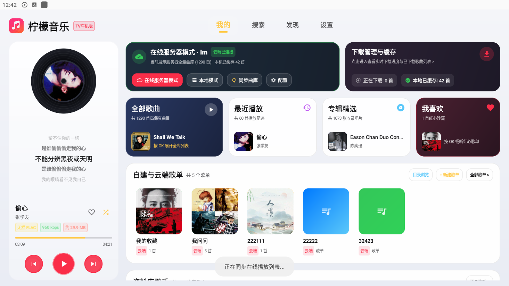
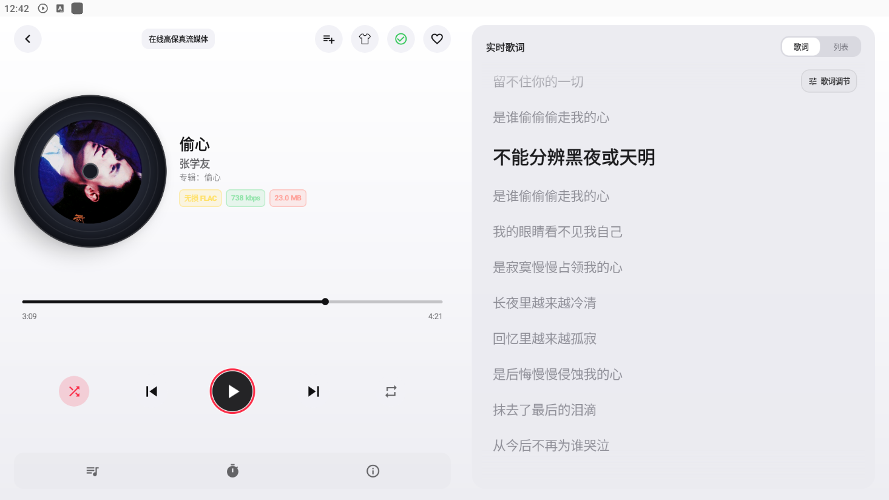
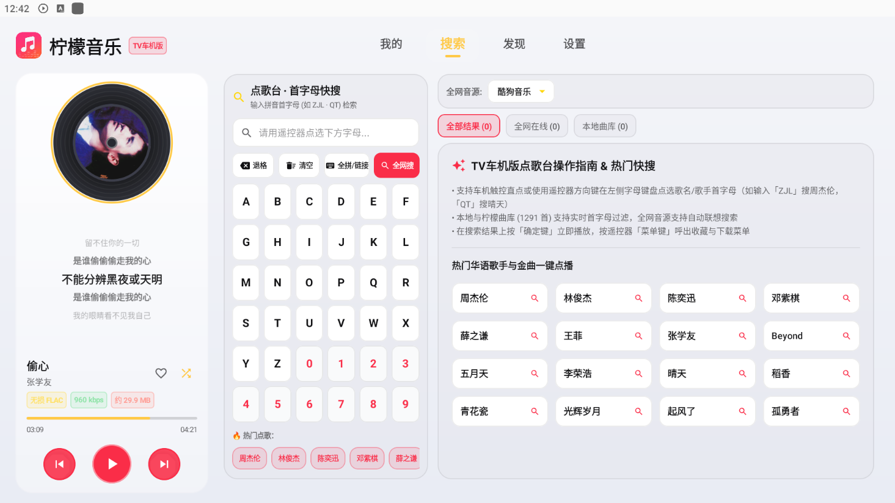
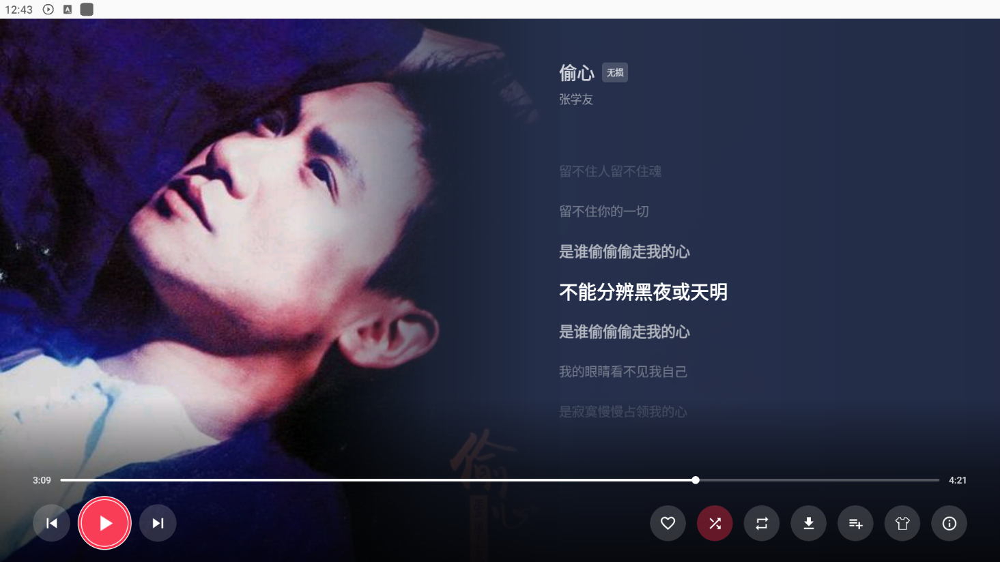

<p align="center">
  
</p>

<h1 align="center">🚗 LMPlayer TV 车机版</h1>

<p align="center">
  <strong>专为智能电视、机顶盒与车载中控横屏大屏打造的高保真无损音乐播放器</strong>
</p>

<p align="center">
  <a href="https://github.com/zyhub/LMPlayer-tvcar/releases"></a>
  
  
  
  
</p>

---

## 📖 项目简介

**LMPlayer TV 车机版** 是与手机版分开发布、独立演进的横屏大屏版本，针对**遥控器方向键**与**车机触控**两套交互分别调优：遥控器全链路可聚焦、可盲操作，触控区则按车载大屏的视距与手指半径放大热区。

深度对接 **柠檬音乐 (Lemon Music)** 服务端私有云曲库，同时聚合 **酷我、网易云、QQ 音乐、酷狗、咪咕** 五大音源的全网检索与试听；具备本地曲库全盘高速扫描与智能比对、全屏沉浸式超大封面、实时逐行歌词、下载管理与离线播放等能力。

> 🍋 **配套柠檬音乐服务端仓库**：[jia070310/lemon-muisc](https://github.com/jia070310/lemon-muisc) —— 专为飞牛 NAS / Linux 打造的音乐后端，支持多用户、音源集中托管与云端私有曲库缓存，与本客户端 API 深度互通。

---

## 📸 应用界面截图

<div align="center">

| 发现 · 五音源聚合与云端推荐 | 我的 · 在线服务器模式与曲库总览 |
| :---: | :---: |
|  |  |

| 播放 · 超大黑胶封面与实时歌词 | 搜索 · 点歌台首字母快搜 |
| :---: | :---: |
|  |  |

| 横屏沉浸 · 全屏歌词与遥控器播控 |
| :---: |
|  |

</div>

---

## ✨ 核心特性

- **🍋 柠檬服务端专属对接** —— 私有云曲库、歌单与收藏同步、服务器播放列表挂载；支持在「在线服务器模式」与「本地模式」间一键切换。
- **🔍 五大音源全网聚合** —— 酷我 / 网易云 / QQ 音乐 / 酷狗 / 咪咕，按**歌名 + 歌手 + 时长 + 版本**（Live / 演唱会 / 黑胶 / 伴奏）智能匹配，避免同名多版本串歌。
- **🎚️ 精准音质下载** —— 单首与批量下载共用同一套音质决策：**严格按所选音质取流**，服务器原文件音质不符时自动改向音源按目标音质解析，服务器与音源都拿不到时逐级降级（`flac24bit → flac → 320k → 128k`）并在完成提示中标注**实际音质**；已在服务器或本地且音质已达标的歌曲自动跳过，不重复下载。
- **📚 曲库多维度排序** —— 默认按「加入时间」倒序（在线取服务器文件添加时间，本地取下载完成时间），并可循环切换按歌名、歌手、时长、来源等排序。
- **🕘 最近播放时间线** —— 以真实播放时间为唯一真源排序，暂停续播不会打乱历史顺序。
- **🎤 实时逐行歌词** —— 逐行高亮滚动、原位歌词微调节拍偏移，横屏双列沉浸展示。
- **💾 本地曲库深度扫描** —— 全盘音频文件高速扫描与智能比对入库，支持 SAF 目录授权与无损格式解析。
- **🎮 遥控器 / 触控双栖适配** —— 方向键焦点链路完整，菜单键呼出下载与收藏操作，触控热区按大屏视距放大。

---

## 📥 下载与安装

前往 **[Releases](https://github.com/zyhub/LMPlayer-tvcar/releases)** 下载最新安装包，文件名形如 `LMPlayerTV-<版本号>.apk`：

1. 将 APK 拷贝至 U 盘，插入电视 / 车机后通过文件管理器安装；
2. 或直接用电视端浏览器 / 下载工具打开 Release 页面链接安装；
3. 首次安装需在系统设置中允许「安装未知来源应用」。

> 安装包使用固定签名发布，后续版本可直接覆盖升级，**无需卸载**。

## 🔄 应用内更新

客户端「设置 → 检查更新」已**挂载到本仓库的 Releases**：程序请求 GitHub Releases 接口读取最新 tag 与 `LMPlayerTV-*.apk` 资源，自动比对版本号并下载。因此**每次发版只需在此仓库创建 Release 并上传 APK**，用户端即可直接拉取更新，无需改动程序。

---

## 🛠️ 编译构建

```bash
# 环境：JDK 17、Android SDK 34
./gradlew :app:assembleRelease
```

产物位于 `app/build/outputs/apk/release/`。

**关于签名**：出于安全考虑，**签名密钥与口令不包含在本仓库中**。release 构建会依次从
`local.properties` 的 `lmplayer.storePassword` / `lmplayer.keyAlias` / `lmplayer.keyPassword`
（可选 `lmplayer.storeFile` 指定密钥路径）或同名环境变量 `LMPLAYER_STORE_PASSWORD` /
`LMPLAYER_KEY_ALIAS` / `LMPLAYER_KEY_PASSWORD` / `LMPLAYER_STORE_FILE` 读取；密钥缺省时寻找
`app/lmplayer-tv-release.jks`。三者都不存在时构建**依然成功**，只是产出未签名 APK，
便于直接编译体验而无需泄露发布密钥。

---

## 📝 更新日志

### v1.10.6
- 新增「平台模式」：首次启动二选一（电视/机顶盒 vs 车机/中控），车机模式停用遥控器焦点体系以省资源，可随时在设置中切换
- 修复方向盘/遥控器切歌连跳 2~3 首、按了没反应、按住连跳等问题，按键防抖改为按键级计时
- 车机模式不再把频道/翻页键误当切歌键，避免旋钮/模式键引发莫名跳歌
- 启用音频焦点：导航播报、倒车雷达、来电自动暂停或压低，拔耳机/断蓝牙自动暂停
- 熄火/关机同步落盘播放进度，下次上车继续听；进度落盘不阻塞 UI 线程
- 左侧黑胶播控卡进度条支持点击/拖动跳转

### v1.10.3
- 修复服务器曲库歌曲选低音质仍下到无损源文件的问题，下载严格按所选音质取流
- 曲库默认按「加入时间」排序：在线取服务器添加时间，本地取下载完成时间
- 批量下载与单首下载统一同一套音质决策，已在服务器 / 本地的歌曲不再重复下载
- 「最近播放」按真实播放时间排序，暂停续播不再打乱顺序

> 更早版本（1.5.x – 1.10.2）的完整变更记录见项目历史提交与各版本 Release 说明。

---

## ⚠️ 免责声明

本项目仅供**个人学习与技术研究**使用，不得用于任何商业用途。所有音乐内容均来自第三方音源接口，
本项目不存储、不制作、不分发任何音频资源，版权归原作者及唱片公司所有。请于下载后 24 小时内删除，
并支持购买正版音乐。因使用本项目产生的任何法律纠纷与后果，均由使用者自行承担。

## 📄 License

[MIT](LICENSE) © 2026 Zhou (zyhub)
